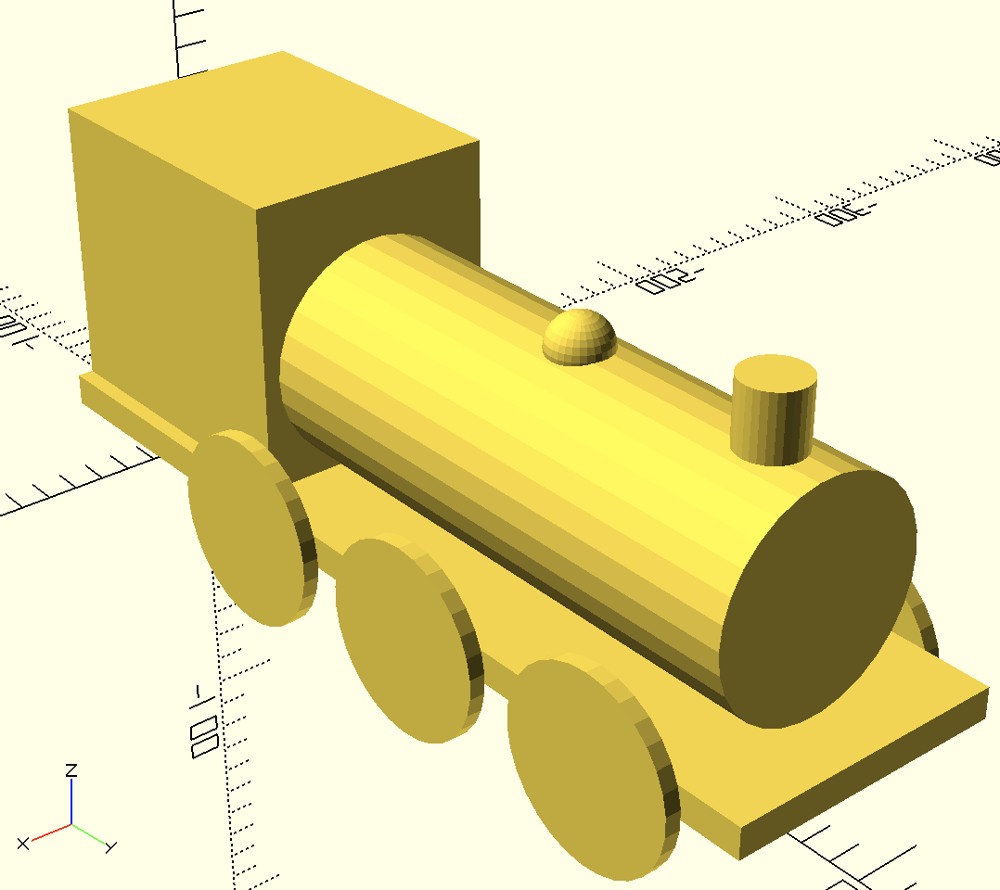

# Day 7

Today is another exercise:

I'd like you to have a go at making this...

If you want some dimensions:
- It's 300mm long.
- It's 100mm wide, including the wheels.

I suggest you make the origin the point on the ground on the back line of the chassis, on the centre line of the train.

I'd like it in a module called `locomotive` in a file called `day07.scad`.